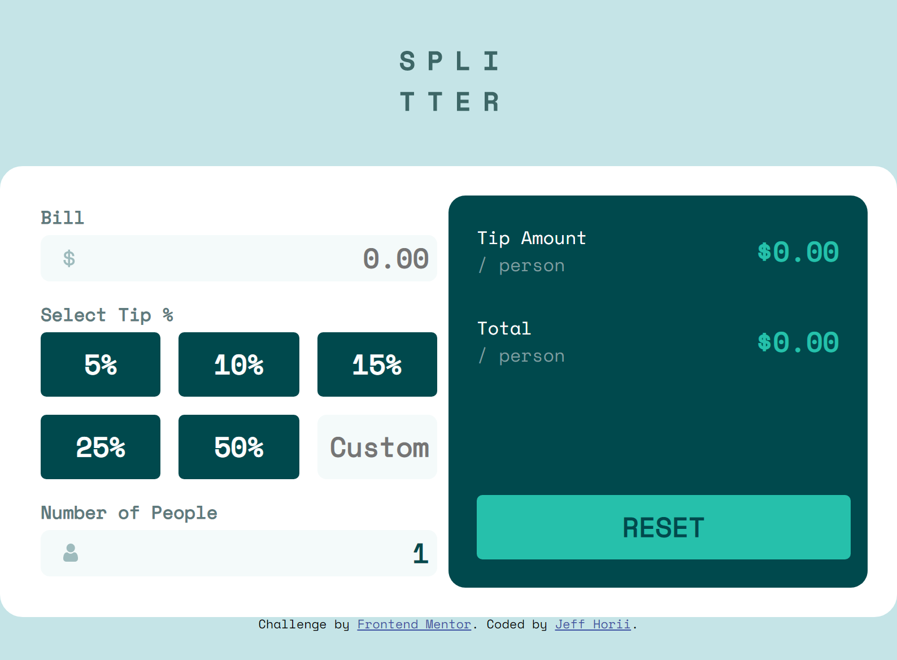

# Frontend Mentor - Tip calculator app solution

This is a solution to the [Tip calculator app challenge on Frontend Mentor](https://www.frontendmentor.io/challenges/tip-calculator-app-ugJNGbJUX). Frontend Mentor challenges help you improve your coding skills by building realistic projects.

## Table of contents

- [Overview](#overview)
  - [The challenge](#the-challenge)
  - [Screenshot](#screenshot)
  - [Links](#links)
- [My process](#my-process)
  - [Built with](#built-with)
  - [What I learned](#what-i-learned)
  - [Continued development](#continued-development)
  - [Useful resources](#useful-resources)
- [Author](#author)

**Note: Delete this note and update the table of contents based on what sections you keep.**

## Overview

### The challenge

Users should be able to:

- View the optimal layout for the app depending on their device's screen size
- See hover states for all interactive elements on the page
- Calculate the correct tip and total cost of the bill per person

### Screenshot

### Links

- Solution URL: [Click here](https://github.com/jhorii/FrontendMentor-TipCalculatorApp)
- Live Site URL: [Click here](https://jhorii.github.io/FrontendMentor-TipCalculatorApp/)

## My process

### Built with

- Semantic HTML5 markup
- CSS custom properties
- Flexbox
- CSS Grid
- Mobile-first workflow

### What I learned

I'm pretty old school with most of my HTML and CSS so flexbox/grid are pretty new for me.  So this project was to get some experience with that.

My JS is also pretty amateur so this was a good project to improve upon that.

Most of my work, I don't have to create custom form fields so developing a custom validation message was good and also playing with some of the form field settings.  The little things like setting the field to "number" or setting a minimum value make a big difference in the usability.

I made sure that when clicking a text box that it would highlight the text on-click (at least for android.....)

### Continued development

I still need work on Javascript/CSS/HTML but this is a good start.  Most of what I need to improve upon is not relying on looking up how to do something.  That is very time consuming and inefficient.

### Useful resources

- [CSS Tricks - Complete Guide to grid](https://css-tricks.com/snippets/css/complete-guide-grid/)
- [CSS Tricks - Complete Guide to flexbox](https://css-tricks.com/snippets/css/a-guide-to-flexbox/)

## Author

- Frontend Mentor - [@jhorii](https://www.frontendmentor.io/profile/jhorii)
